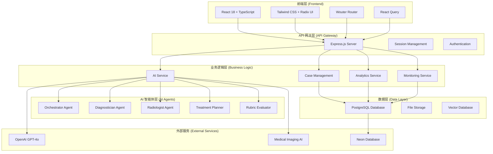
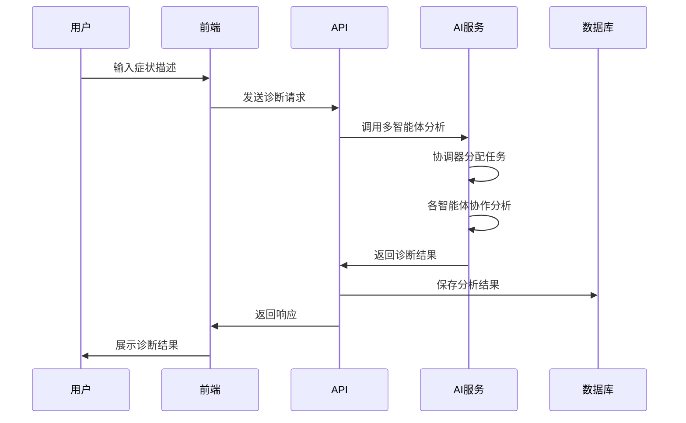
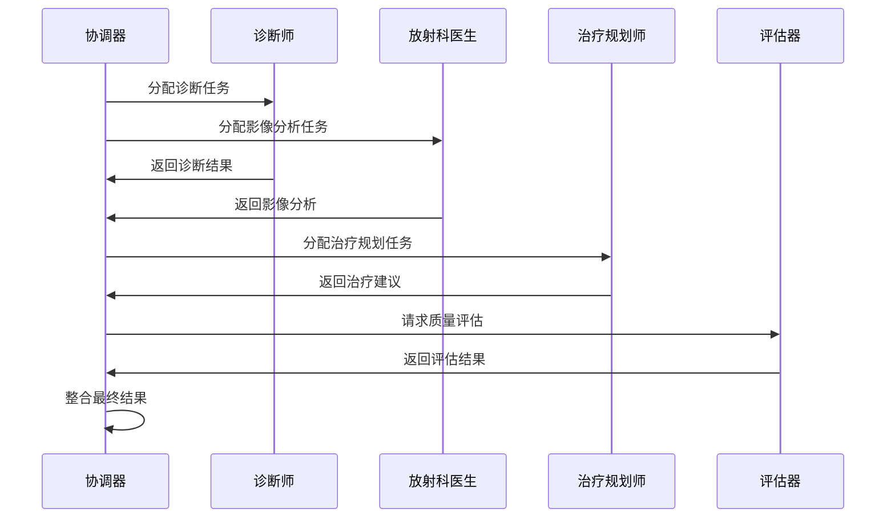

# 系统架构概览

## 🏗️ 整体架构

Bone Guardian 是一个基于微服务架构的医疗 AI 诊断平台，采用前后端分离的设计模式，结合多智能体 AI 系统，为医疗专业人员提供精确的最小创伤骨折诊断和治疗规划。

### 架构图



## 🎯 核心设计原则

### 1. 微服务架构

- **服务分离**: 每个功能模块独立部署和扩展
- **API 优先**: 所有服务通过 RESTful API 通信
- **容器化**: 支持 Docker 容器化部署

### 2. 多智能体 AI 系统

- **专业化分工**: 每个 AI 智能体专注于特定医疗领域
- **协作机制**: 智能体之间通过协调器进行协作
- **持续学习**: 基于 Rubric 评估的反馈学习机制

### 3. 数据驱动决策

- **实时分析**: 系统性能和诊断准确率实时监控
- **业务智能**: 基于数据的业务洞察和优化建议
- **预测分析**: AI 驱动的趋势预测和风险评估

## 🏛️ 技术栈

### 前端技术栈

| 技术          | 版本    | 用途       | 选择理由             |
| ------------- | ------- | ---------- | -------------------- |
| React         | 18.3.1  | UI 框架    | 组件化开发，生态丰富 |
| TypeScript    | 5.6.3   | 类型系统   | 类型安全，开发效率高 |
| Tailwind CSS  | 3.4.17  | 样式框架   | 实用优先，开发速度快 |
| Radix UI      | Latest  | 组件库     | 无障碍，可定制性强   |
| Wouter        | 3.3.5   | 路由       | 轻量级，性能优秀     |
| React Query   | 5.60.5  | 状态管理   | 服务端状态管理       |
| Framer Motion | 11.13.1 | 动画       | 流畅的用户体验       |
| Recharts      | 2.15.2  | 数据可视化 | 医疗数据图表展示     |

### 后端技术栈

| 技术        | 版本   | 用途       | 选择理由                |
| ----------- | ------ | ---------- | ----------------------- |
| Node.js     | Latest | 运行时     | JavaScript 全栈开发     |
| Express.js  | 4.21.2 | Web 框架   | 轻量级，中间件丰富      |
| TypeScript  | 5.6.3  | 类型系统   | 类型安全，代码质量      |
| Drizzle ORM | 0.39.1 | 数据库 ORM | 类型安全，性能优秀      |
| PostgreSQL  | Latest | 数据库     | 关系型数据库，ACID 特性 |
| OpenAI      | 5.21.0 | AI 服务    | GPT-4o 医疗 AI 能力     |

### 基础设施

| 技术    | 用途       | 选择理由            |
| ------- | ---------- | ------------------- |
| Neon    | 数据库托管 | 无服务器 PostgreSQL |
| Vite    | 构建工具   | 快速开发，热更新    |
| ESBuild | 打包工具   | 极速构建            |
| Docker  | 容器化     | 环境一致性          |

## 🔄 系统流程

### 1. 用户交互流程



### 2. AI 智能体协作流程



## 📊 性能指标

### 系统性能

- **响应时间**: 平均 2.3 秒
- **并发用户**: 支持 100+ 并发用户
- **可用性**: 99.9% 系统可用性
- **扩展性**: 水平扩展支持

### AI 性能

- **诊断准确率**: 96.5%
- **置信度**: 平均 91.2%
- **处理速度**: 每病例 2.3 秒
- **学习能力**: 月改进率 2.1%

## 🔒 安全架构

### 数据安全

- **加密传输**: HTTPS/TLS 1.3
- **数据加密**: AES-256 数据库加密
- **访问控制**: 基于角色的权限管理
- **审计日志**: 完整的操作审计

### 合规性

- **HIPAA 合规**: 医疗数据隐私保护
- **数据保留**: 符合医疗数据保留要求
- **备份策略**: 自动备份和灾难恢复
- **监控告警**: 实时安全监控

## 🚀 部署架构

### 开发环境

```bash
# 本地开发
npm run dev          # 启动开发服务器
npm run db:push      # 推送数据库模式
npm run check        # 类型检查
```

### 生产环境

```bash
# 生产构建
npm run build        # 构建生产版本
npm start           # 启动生产服务器
```

### 容器化部署

```dockerfile
# Dockerfile 示例
FROM node:18-alpine
WORKDIR /app
COPY package*.json ./
RUN npm ci --only=production
COPY . .
RUN npm run build
EXPOSE 3000
CMD ["npm", "start"]
```

## 📈 扩展性设计

### 水平扩展

- **负载均衡**: 多实例负载分发
- **数据库分片**: 按功能模块分片
- **缓存策略**: Redis 缓存层
- **CDN 加速**: 静态资源 CDN

### 垂直扩展

- **资源监控**: CPU、内存、存储监控
- **自动扩缩容**: 基于负载的自动扩缩容
- **性能优化**: 数据库查询优化
- **代码优化**: 算法和数据结构优化

## 🔮 未来架构演进

### 短期目标 (3-6 个月)

- **微服务拆分**: 进一步拆分服务边界
- **事件驱动**: 引入事件驱动架构
- **API 网关**: 统一 API 网关管理
- **监控完善**: 完善监控和告警系统

### 中期目标 (6-12 个月)

- **云原生**: 全面云原生架构
- **AI 模型优化**: 本地 AI 模型部署
- **实时协作**: WebSocket 实时协作
- **移动端**: 移动端应用开发

### 长期目标 (1-2 年)

- **边缘计算**: 边缘 AI 推理
- **联邦学习**: 分布式 AI 训练
- **区块链**: 医疗数据区块链存储
- **量子计算**: 量子 AI 算法研究

---

**Bone Guardian** - 构建下一代医疗 AI 诊断平台 🏥🤖
