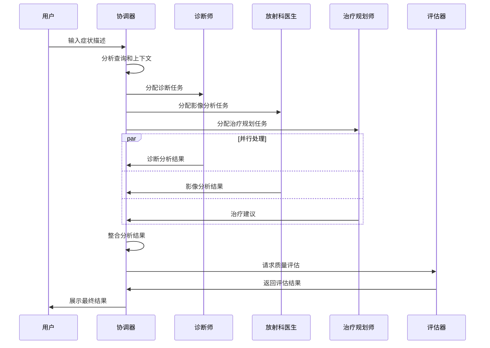
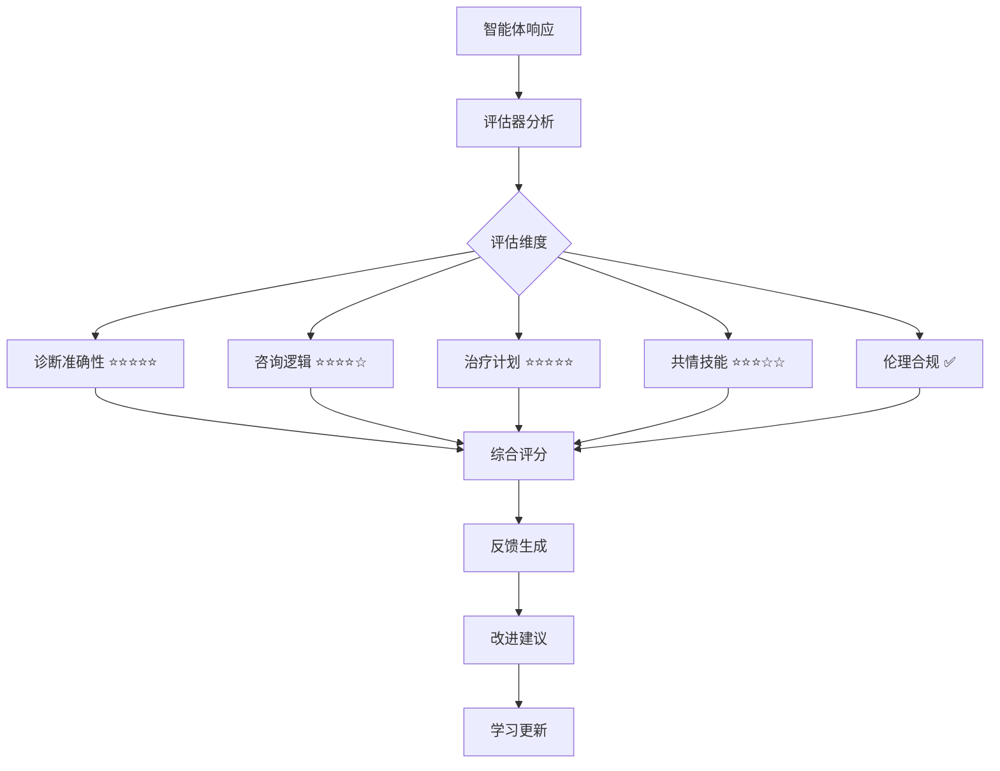

# 多智能体聊天系统

## 🎯 功能概述

多智能体聊天系统是 HealthAI 平台的核心功能，通过多个专业 AI 智能体的协作，为医疗专业人员提供全面的诊断分析、治疗建议和临床决策支持。

## 🤖 智能体架构

### 智能体组成

#### 1. HealthAI Orchestrator (协调器)
- **角色**: 系统协调和任务分配
- **职责**: 
  - 分析用户查询和患者上下文
  - 协调其他智能体的响应
  - 整合多智能体分析结果
  - 管理对话流程和状态
- **图标**: 🤖 Bot
- **颜色**: 蓝色 (#3B82F6)

#### 2. Dr. Neural (诊断师)
- **角色**: 主要诊断分析专家
- **职责**:
  - 提供诊断洞察和临床推理
  - 专注于鉴别诊断
  - 分析症状模式和疾病关联
  - 提供诊断置信度评估
- **图标**: 🧠 Brain
- **颜色**: 绿色 (#10B981)

#### 3. RadiologyAI (放射科医生)
- **角色**: 医学影像分析专家
- **职责**:
  - 医学影像分析专家
  - 专注于影像模式和放射学发现
  - 微骨折检测和骨密度分析
  - 影像学诊断建议
- **图标**: 📄 FileText
- **颜色**: 紫色 (#8B5CF6)

#### 4. TreatmentBot (治疗规划师)
- **角色**: 治疗规划和护理建议
- **职责**:
  - 提供循证治疗建议
  - 制定个性化护理计划
  - 药物推荐和剂量建议
  - 康复指导和随访计划
- **图标**: 🩺 Stethoscope
- **颜色**: 橙色 (#F59E0B)

#### 5. Clinical Rubric Evaluator (临床评估器)
- **角色**: 质量评估和反馈
- **职责**:
  - 评估其他智能体的响应质量
  - 提供临床标准符合性检查
  - 生成改进建议
  - 持续学习反馈
- **图标**: 🎯 Target
- **颜色**: 红色 (#EF4444)

## 🔄 工作流程

### 1. 对话启动流程


### 2. Rubric 评估流程


## 📊 评估体系

### Rubric 评估维度

#### 1. 诊断准确性 (Diagnostic Accuracy)
- **评分标准**: 1-5 星
- **评估内容**:
  - 症状识别准确性
  - 疾病诊断正确性
  - 鉴别诊断完整性
  - 临床推理逻辑性
- **权重**: 30%

#### 2. 咨询逻辑 (Consultation Logic)
- **评分标准**: 1-5 星
- **评估内容**:
  - 问题逻辑性
  - 信息收集完整性
  - 推理过程清晰性
  - 结论合理性
- **权重**: 25%

#### 3. 治疗计划 (Treatment Plan)
- **评分标准**: 1-5 星
- **评估内容**:
  - 治疗方案可行性
  - 药物选择合理性
  - 剂量建议准确性
  - 随访计划完整性
- **权重**: 25%

#### 4. 共情技能 (Empathy Skills)
- **评分标准**: 1-5 星
- **评估内容**:
  - 沟通清晰度
  - 患者关怀度
  - 解释易懂性
  - 情感支持度
- **权重**: 15%

#### 5. 伦理合规 (Ethics Compliance)
- **评分标准**: ✅ 合规 / ⚠️ 警告 / ❌ 风险
- **评估内容**:
  - 医疗安全合规
  - 隐私保护合规
  - 伦理标准符合
  - 风险控制措施
- **权重**: 5%

### 评分计算
```typescript
interface RubricEvaluation {
  scores: {
    diagnosticAccuracy: number;    // 1-5 stars
    consultationLogic: number;     // 1-5 stars
    treatmentPlan: number;         // 1-5 stars
    empathySkills: number;         // 1-5 stars
    ethicsCompliance: 'compliant' | 'warning' | 'risk';
  };
  totalScore: number;              // 0-100
  feedback: {
    strengths: string[];
    improvements: string[];
    recommendations: string[];
  };
}
```

## 🎨 用户界面设计

### 聊天界面布局
```
┌─────────────────────────────────────────────────────────┐
│ 🤖 Enhanced Multi-Agent Consultation        [Performance] │
├─────────────────────────────────────────────────────────┤
│                                                         │
│ 👤 You                                    [时间戳]        │
│ 患者症状描述...                                           │
│                                                         │
│ 🤖 HealthAI Orchestrator                [95%] [时间戳]    │
│ 正在协调专业团队进行综合分析...                           │
│                                                         │
│ 🧠 Dr. Neural                           [92%] [时间戳]    │
│ 基于症状分析，我建议考虑以下诊断...                       │
│ ⭐⭐⭐⭐⭐ 诊断准确性 ⭐⭐⭐⭐☆ 咨询逻辑 ⭐⭐⭐⭐⭐ 治疗计划 │
│ ⭐⭐⭐☆☆ 共情技能 ✅ 伦理合规                            │
│                                                         │
│ 📄 RadiologyAI                          [88%] [时间戳]    │
│ 影像分析显示...                                         │
│ ⭐⭐⭐⭐⭐ 诊断准确性 ⭐⭐⭐⭐⭐ 咨询逻辑 ⭐⭐⭐⭐☆ 治疗计划 │
│ ⭐⭐⭐⭐☆ 共情技能 ✅ 伦理合规                            │
│                                                         │
│ 🩺 TreatmentBot                         [90%] [时间戳]    │
│ 治疗建议如下...                                         │
│ ⭐⭐⭐⭐☆ 诊断准确性 ⭐⭐⭐⭐☆ 咨询逻辑 ⭐⭐⭐⭐⭐ 治疗计划 │
│ ⭐⭐⭐⭐☆ 共情技能 ✅ 伦理合规                            │
│                                                         │
│ 🎯 Clinical Rubric Evaluator            [98%] [时间戳]    │
│ 临床性能评估完成。整体会话评分：89/100...                │
│                                                         │
├─────────────────────────────────────────────────────────┤
│ [输入框]                                    [发送]        │
└─────────────────────────────────────────────────────────┘
```

### 性能面板
```
┌─────────────────────────────────────────────────────────┐
│ 📊 Agent Performance Panel                              │
├─────────────────────────────────────────────────────────┤
│ 🤖 HealthAI Orchestrator                               │
│ 成功率: 98.5% ████████████████████ 98.5%               │
│ 响应时间: 1.2s ████████████████████ 1.2s               │
│ 置信度: 95% ████████████████████ 95%                    │
│ 趋势: ↗️ 改进中                                          │
│                                                         │
│ 🧠 Dr. Neural                                          │
│ 成功率: 96.2% ████████████████████ 96.2%               │
│ 响应时间: 2.1s ████████████████████ 2.1s               │
│ 置信度: 92% ████████████████████ 92%                    │
│ 趋势: ↗️ 改进中                                          │
│                                                         │
│ 📄 RadiologyAI                                         │
│ 成功率: 94.8% ████████████████████ 94.8%               │
│ 响应时间: 1.8s ████████████████████ 1.8s               │
│ 置信度: 88% ████████████████████ 88%                    │
│ 趋势: ➡️ 稳定                                            │
│                                                         │
│ 🩺 TreatmentBot                                        │
│ 成功率: 97.1% ████████████████████ 97.1%               │
│ 响应时间: 1.5s ████████████████████ 1.5s               │
│ 置信度: 90% ████████████████████ 90%                    │
│ 趋势: ↗️ 改进中                                          │
│                                                         │
│ 🎯 Clinical Rubric Evaluator                           │
│ 成功率: 99.2% ████████████████████ 99.2%               │
│ 响应时间: 0.8s ████████████████████ 0.8s               │
│ 置信度: 98% ████████████████████ 98%                    │
│ 趋势: ➡️ 稳定                                            │
└─────────────────────────────────────────────────────────┘
```

## 🔧 技术实现

### 核心组件

#### 1. MultiAgentChat 组件
```typescript
interface MultiAgentChatProps {
  caseId?: string;
  patientName?: string;
}

export function MultiAgentChat({ caseId, patientName }: MultiAgentChatProps) {
  const [messages, setMessages] = useState<EnhancedMessage[]>([]);
  const [isProcessing, setIsProcessing] = useState(false);
  const [showPerformancePanel, setShowPerformancePanel] = useState(false);
  
  // 消息处理逻辑
  const handleSendMessage = async () => {
    // 发送用户消息
    // 触发多智能体分析
    // 更新消息状态
  };
  
  // 智能体响应模拟
  const simulateAgentResponse = async (userQuery: string) => {
    // 协调器响应
    // 各专业智能体响应
    // 评估器评估
    // 更新消息和评估
  };
}
```

#### 2. RubricScoreDisplay 组件
```typescript
function RubricScoreDisplay({ evaluation }: { evaluation: RubricEvaluation }) {
  const renderStars = (score: number) => {
    return Array.from({ length: 5 }, (_, i) => (
      <Star 
        key={i} 
        className={`w-3 h-3 ${i < score ? 'text-yellow-400 fill-current' : 'text-gray-300'}`} 
      />
    ));
  };
  
  return (
    <div className="mt-2 p-3 bg-yellow-50 dark:bg-yellow-950/20 rounded-lg">
      <div className="flex items-center justify-between mb-2">
        <span className="text-sm font-medium">Clinical Assessment</span>
        <Badge variant="outline" className="text-yellow-700">
          {evaluation.totalScore}/100
        </Badge>
      </div>
      {/* 星级评分显示 */}
    </div>
  );
}
```

#### 3. AgentPerformancePanel 组件
```typescript
function AgentPerformancePanel({ performances }: { performances: AgentPerformance[] }) {
  return (
    <Card>
      <CardHeader>
        <CardTitle className="flex items-center">
          <BarChart3 className="w-5 h-5 mr-2" />
          Agent Performance Overview
        </CardTitle>
      </CardHeader>
      <CardContent>
        {performances.map((performance) => (
          <div key={performance.agentType} className="mb-4">
            {/* 性能指标显示 */}
          </div>
        ))}
      </CardContent>
    </Card>
  );
}
```

### 数据流管理

#### 1. 消息状态管理
```typescript
interface EnhancedMessage extends Message {
  evaluation?: RubricEvaluation;
  isEvaluated: boolean;
}

const [messages, setMessages] = useState<EnhancedMessage[]>([]);
```

#### 2. 智能体配置
```typescript
export const ENHANCED_AGENT_CONFIG: Record<string, AgentConfig> = {
  orchestrator: {
    name: 'HealthAI Orchestrator',
    icon: 'Bot',
    color: 'bg-blue-100 text-blue-800',
    role: 'System Coordinator',
    specialty: 'Multi-Agent Orchestration',
    evaluationWeight: 0.2
  },
  // ... 其他智能体配置
};
```

## 📈 性能优化

### 1. 响应时间优化
- **并行处理**: 多个智能体并行分析
- **缓存机制**: 常见查询结果缓存
- **异步处理**: 非阻塞式消息处理
- **流式响应**: 实时响应更新

### 2. 用户体验优化
- **加载状态**: 清晰的加载指示器
- **错误处理**: 友好的错误提示
- **响应式设计**: 多设备适配
- **无障碍支持**: 键盘导航和屏幕阅读器

### 3. 系统稳定性
- **错误恢复**: 自动错误恢复机制
- **降级策略**: 服务降级处理
- **监控告警**: 实时性能监控
- **日志记录**: 完整的操作日志

## 🔮 未来发展方向

### 短期优化 (1-3 个月)
- **实时协作**: WebSocket 实时通信
- **语音交互**: 语音输入和输出
- **多语言支持**: 国际化支持
- **移动端优化**: 移动设备适配

### 中期发展 (3-6 个月)
- **个性化学习**: 基于用户偏好的个性化
- **知识图谱**: 医疗知识图谱集成
- **预测分析**: 疾病预测和风险评估
- **协作功能**: 多医生协作诊断

### 长期愿景 (6-12 个月)
- **边缘计算**: 本地 AI 推理
- **联邦学习**: 分布式 AI 训练
- **量子计算**: 量子 AI 算法
- **脑机接口**: 直接思维交互

---

**HealthAI 多智能体聊天系统** - 让 AI 医生团队为您的诊断保驾护航 🏥🤖
